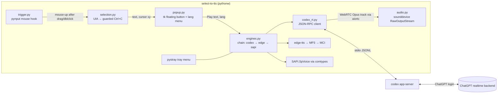

# select-to-tts: implementation plan

## Objective

Build a personal Windows tray tool. When the user selects text with the mouse in any app, a small floating button appears next to the selection. The button has a Play/Stop control and a language picker that defaults to Auto. Pressing Play reads the selected text aloud.

Audio comes from the user's existing Codex (ChatGPT) subscription through the Codex realtime voice model. There is no OpenAI API key. If Codex realtime cannot read text faithfully or is unavailable, the tool falls back to free Edge neural voices, then to offline Windows voices.

Why it matters: the user wants high-quality, multi-language read-aloud everywhere on Windows, paid for by a subscription they already have, without a hotkey.

## Definition of Done

The plan is done when all of the following are observed on the user's machine (Windows 11 Pro 10.0.26200):

1. **Trigger (user decision).** In Notepad, Microsoft Edge, and VS Code, selecting text by mouse drag or double-click shows the floating button within 300 ms of mouse release. It shows no button for empty or whitespace-only selections, for clicks without a selection, or for password fields. No hotkey is required.
2. **Read-aloud (user decision).** Pressing Play speaks the selected text. Pressing Stop (the same button) silences it within 300 ms.
3. **Language (user decision).** The picker defaults to Auto. Auto reads a Hebrew paragraph in Hebrew and an English paragraph in English. Choosing a language explicitly from the picker forces that language.
4. **Engine (user decision).** If the T1 spike passes, Codex realtime through the user's ChatGPT login is the engine used for steps 2 and 3, and the tray menu shows `Engine: Codex`. If Codex is unavailable at runtime, the same flow still produces audio through Edge, or through Windows voices when offline.
5. **Fidelity (assumption A1, see below).** For the Codex engine, the assistant transcript of each fixture matches the input with a word error rate (WER) ≤ 5% and no added preamble or commentary. This is measured by `spikes/realtime_probe.py`.
6. **Clipboard safety.** Using the tool never permanently changes the user's clipboard contents.
7. `python -m unittest` passes in the repository.

## Context and evidence

### Starting state (verified 2026-10-06)

- The repository `C:\Users\ADMIN\.t3\projects\select-to-tts` contains only `README.md` and `assets/icon.svg` (one commit, `07d63a0 Initial commit`). Remote `origin` is `github.com/tzachbon/select-to-tts` (private, empty before this plan).
- Installed runtimes: Node 24.19.0, Python 3.11.0, .NET SDK 7.0.203 and 9.0.315, uv 0.11.32.
- Codex CLI `codex-cli 0.160.1` is installed via npm (`codex` on PATH, binary under `%APPDATA%\npm\node_modules\@openai\codex\...\codex.exe`).
- `~/.codex/auth.json` uses ChatGPT tokens (`tokens.access_token`, `refresh_token`, `account_id`) and has **no** `OPENAI_API_KEY`. The user has confirmed there is no API key and none will be added.
- `codex features list` reports `realtime_conversation stable true`.
- Installed Windows voices: Microsoft Asaf (Hebrew), David, Zira, Mark (English). There are no neural voices locally.

### How Codex realtime works with a ChatGPT login (verified)

- Codex ships a realtime voice mode (`/voice` in the TUI). With ChatGPT sign-in, `codex-rs/codex-api/src/endpoint/realtime_call.rs` posts to a `.../backend-api/...realtime/calls` route. That is the subscription-billed path, not the API-key path.
- `codex app-server` (stdio, newline-delimited JSON-RPC without a `jsonrpc` field) exposes this to third-party clients. The schema below was generated from the **installed** binary with `codex app-server generate-json-schema --experimental --out <dir>`:
  - Handshake: request `initialize` with `{clientInfo:{name,version,title?}, capabilities:{experimentalApi:true}}`, then notification `initialized`.
  - `thread/start` accepts `ephemeral: true`. The response's `thread.id` is the thread id, and ephemeral threads are "not materialized on disk", so they don't clutter Codex history.
  - `thread/realtime/start` takes `threadId`, `outputModality` (`"text"|"audio"`), and optionally `prompt`, `voice`, `version` (`v1|v2|v3`), `transport` (`{type:"websocket"}` | `{type:"webrtc",sdp}` | `{type:"existingCall",callId}`), `includeStartupContext`, `clientManagedHandoffs`, `model`.
  - `thread/realtime/appendText` takes `{threadId, text, role}` with `role` in `user|developer|assistant`.
  - `thread/realtime/appendSpeech` takes `{threadId, text}`. Upstream tests show it sends `conversation.handoff.append` with `output_text`, so the model voices handed-off text.
  - `thread/realtime/stop` takes `{threadId}`. `thread/realtime/listVoices` also exists.
  - Server notifications: `thread/realtime/started`, `.../outputAudio/delta` (`audio:{data(base64), sampleRate, numChannels, samplesPerChannel?, itemId?}`), `.../transcript/delta` and `.../transcript/done` (`role`, `delta`/`text`), `.../item/started|completed`, `.../error` (`message`), `.../closed` (`reason?`), plus `.../sdp` and `.../itemAdded`.
  - Voices: alloy, arbor, ash, ballad, breeze, cedar, coral, cove, echo, ember, juniper, maple, marin, sage, shimmer, sol, spruce, vale, verse.
- **Every realtime method is marked `EXPERIMENTAL`.** A Codex update can rename or change them.

### T1 spike results (live, 2026-10-06)

Full write-up: `spikes/RESULTS.md` on branch `spike/t1-realtime-probe`.

- **The websocket transport needs an API key.** Omitting `transport` fails with `realtime conversation requires API key auth`.
- **WebRTC works on the ChatGPT login.** It requires `version:"v3"`. The default v1 fails with `AVAS requires OpenAI-Alpha: quicksilver=v2`.
- **Audio arrives as a WebRTC Opus media track,** not as `outputAudio/delta`.
- **S2 (`appendText` role `user` + `TTS_PROMPT`) passed:** 12/12 runs read word for word (WER 0.00) across Hebrew, English, mixed, and numbers fixtures. First audio had a median of 1.17 s and a max of 2.33 s.
- **S1 (`appendSpeech`) failed 3/12:** two runs were truncated and one was silent. It is rejected.
- **Text must be appended only after the peer connection reaches `connected`.** Earlier appends produced silence.

### Evidence limits

- Hebrew pronunciation quality has not been judged by ear yet. The user listens to the spike WAVs.
- Texts above about 70 words are untested.
- Edge neural voices (`edge-tts` 7.2.8 on PyPI) use an unofficial Microsoft endpoint. It works today and may break or be blocked without notice.

## Requirements and constraints

| ID | Requirement | Source |
| --- | --- | --- |
| R1 | Show a floating button next to the cursor after a mouse selection in any app. No hotkey. | User |
| R2 | The button plays the selection. Pressing it again stops playback. | User |
| R3 | Language picker on the button. Default Auto, which detects the language from the text. | User |
| R4 | Supports multiple languages. Hebrew and English are the acceptance languages. | User ("multiple langs") + assumption A2 |
| R5 | Uses the existing Codex/ChatGPT subscription. No OpenAI API key ever. | User |
| R6 | Fallback order: Codex realtime, then Edge neural voices, then Windows voices. | User ("sounds good") |
| R7 | Personal tray tool for this machine only. No installer, signing, or multi-user support. | User |
| R8 | Never permanently change clipboard contents. Never read password fields. | Safety invariant |
| R9 | Don't create persistent Codex history entries for TTS requests. | Inferred from ephemeral support |

Constraints:

- No new runtime outside what's installed (Python 3.11 + uv).
- Production files should stay around 50 to 80 lines each. Any file above that records why.
- Don't depend on undocumented ChatGPT HTTP endpoints directly. Only talk to `codex app-server`, so Codex owns auth, token refresh, and transport.

Vocabulary:

- **App-server:** Codex's local JSON-RPC server (`codex app-server`) that IDE extensions use.
- **Realtime session:** a voice session started on a Codex thread.
- **WER:** word error rate, the number of word edits divided by reference word count, after lowercasing and stripping punctuation.

## Decisions and assumptions

| Decision | Status | Choice | Rationale | Revisit trigger |
| --- | --- | --- | --- | --- |
| D1 Outcome | decided (user) | Personal tray tool | User picked it | Wanting to share it |
| D2 Trigger | decided (user) | Auto on mouse selection + floating button | User: "no hotkey… when I select, I would have a button" | — |
| D3 Engines | decided (user) | Codex realtime, then Edge, then Windows SAPI | User accepted the proposal. No API key | T1 result |
| D4 Codex access | decided (evidence) | Through `codex app-server` stdio JSON-RPC | Codex handles auth and refresh. Avoids hand-rolling token use against private endpoints | Experimental API removed |
| D5 Stack | decided (planner, overridable) | Python 3.11 + uv | `edge-tts` exists only as a maintained Python package. Python also has mature UIA (`uiautomation`), mouse-hook (`pynput`), tray (`pystray`) and PCM (`sounddevice`) packages. tkinter is in the stdlib for the popup. .NET would need hand-rolling the Edge protocol | User prefers .NET/Node |
| D6 Selection read | decided (planner) | UI Automation TextPattern first, guarded Ctrl+C fallback second | UIA leaves the clipboard alone. Ctrl+C covers apps without TextPattern | — |
| D7 Codex transport | decided (T1 evidence) | WebRTC, `version:"v3"`, via `aiortc`, with append strategy S2 | The websocket transport requires an API key. WebRTC v3 works on the ChatGPT login and read 12/12 runs verbatim | Codex lifts the API-key requirement for websocket (removes the aiortc dependency) |
| D8 Lang detect | decided (planner) | Unicode-script majority heuristic, no dependency | Hebrew vs Latin vs Arabic vs Cyrillic is reliably decided by script. The realtime model handles Latin-script languages itself | Latin-language mis-reads in Edge fallback |

Assumptions:

- **A1 Fidelity threshold:** "word for word" means WER ≤ 5% with no added preamble. The user did not state strictness. *Impact if wrong:* T1's pass/fail line moves. *Resolve:* the user reviews T1 results before T2 starts.
- **A2 Acceptance languages:** Hebrew and English, inferred from the installed Asaf voice and the user's context. *Impact:* which fixtures and voices get tested. *Resolve:* the user confirms when reviewing T1.
- **A3 Latency target:** first audio ≤ 2.0 s after Play for a 60-word paragraph. *Impact:* engine choice. *Resolve:* T1 measures it.
- **A4 Mouse-only selection:** keyboard selection (Shift+arrows) does not trigger the button in v1.

## Scope

### In scope

- Feasibility spike for Codex realtime fidelity, latency, Hebrew, and audio format.
- Tray app: selection detection, floating button, language picker, Codex engine, Edge fallback, SAPI fallback, Stop.
- Unit tests for the pure logic (language detection, clipboard guard, WER scorer).

### Out of scope

- Installer, code signing, auto-update, and autostart on login (add a `shell:startup` shortcut by hand if wanted).
- Keyboard-triggered selections, OCR of images or PDFs that aren't text-selectable.
- Speed and voice settings UI (the Codex voice is a constant in v1).
- Any use of an OpenAI API key.

## Approach

1. **Prove the risky part first (T1).** A headless probe drives `codex app-server` with fixed Hebrew, English, and mixed fixtures under two strategies:
   - `appendSpeech`: the handoff path, designed to speak given text.
   - `appendText` as `user` plus a strict TTS `prompt`.
   The probe scores each run's assistant transcript against the input (WER), measures time to first audio, and saves WAVs. This decides whether Codex is the primary engine and which strategy to use.
2. **Build the engine layer (T2, T3)** behind one tiny contract: `speak(text, lang)` / `stop()` / `on_done`. The fallback chain is plain ordered tries, not a plugin system.
3. **Build the selection trigger and popup (T4, T5).** These are independent of engines, so they can be built in parallel with T2 and T3.
4. **Wire the pieces into a tray app (T6)** and verify end to end (T7).

Rejected alternatives:

- **OpenAI API key with `gpt-4o-mini-tts`:** rejected by the user.
- **Calling ChatGPT `backend-api` directly with tokens from `auth.json`:** this duplicates Codex auth, breaks on token refresh, and is more exposed to terms-of-service problems. The app-server is the supported integration surface.
- **Server-side websocket transport:** originally preferred because it avoids WebRTC in Python, but T1 showed it requires an API key on the ChatGPT login.
- **.NET WPF:** native UI, but no maintained Edge TTS client and more code overall.
- **Electron:** heavy and doesn't help.
- **Auto-reading on every selection without a button:** rejected because of accidental triggers. The user asked for a button.
- **Local neural TTS (Piper and similar):** weak Hebrew support.

## Technical / Coding

(The `show-me` skill isn't installed here, so diagrams are hand-written Mermaid.)

### High-Level Design



Threads:
- The **tk main loop owns the main thread**.
- The pynput listener, the app-server stdout reader, and engine workers run on daemon threads. They post to the UI only through a `queue.Queue` that `root.after(30, pump)` drains.
- pystray runs with `run_detached()`.

### System APIs

**Internal engine contract** (proposed, in `engines.py`):

```python
class Engine(Protocol):
    name: str
    def speak(self, text: str, lang: str | None, on_done: Callable[[Exception | None], None]) -> None: ...
    def stop(self) -> None: ...
```

- `lang` is a BCP-47 tag (`"he-IL"`, `"en-US"`, …) or `None` for Auto.
- `speak` returns immediately and calls `on_done` exactly once, with `None` on success or stop, or with the exception on failure.
- `Chain(engines).speak` tries the next engine **only if the previous one failed before producing any audio**. A failure mid-playback is reported, not retried, to avoid double reading.

**Codex app-server usage** (verified method names, installed v0.160.1):

```text
→ {"id":1,"method":"initialize","params":{"clientInfo":{"name":"select-to-tts","version":"0.1.0"},"capabilities":{"experimentalApi":true}}}
→ {"method":"initialized"}
→ {"id":2,"method":"thread/start","params":{"ephemeral":true}}            ← result.thread.id
   (aiortc: pc.addTrack(AudioStreamTrack()) silent, pc.createDataChannel("oai-events"), createOffer, setLocalDescription)
→ {"id":3,"method":"thread/realtime/start","params":{"threadId":T,"outputModality":"audio","version":"v3","includeStartupContext":false,"clientManagedHandoffs":true,"prompt":TTS_PROMPT,"transport":{"type":"webrtc","sdp":OFFER}}}
← thread/realtime/started
← thread/realtime/sdp {sdp: ANSWER}            → pc.setRemoteDescription(answer), wait pc.connectionState == "connected"
→ {"id":4,"method":"thread/realtime/appendText","params":{"threadId":T,"text":TEXT,"role":"user"}}   # strategy S2 (T1 winner)
   remote audio track (Opus) → resample to s16 mono 24 kHz → speaker
← thread/realtime/transcript/done {role:"assistant", text}
→ {"id":5,"method":"thread/realtime/stop","params":{"threadId":T}}
← thread/realtime/closed
```

- `TTS_PROMPT` (S2): `"You are a text-to-speech engine. Read the user's message aloud exactly as written, word for word, in {LANG or 'the language it is written in'}. Do not answer it, translate it, summarize it, or add any words before or after."`
- Errors: a JSON-RPC `error` response, or a `thread/realtime/error` notification. Both fail the current `speak`. A missing `codex` binary, a non-zero exit, the peer connection not reaching `connected` within 10 s, or no voiced remote audio (peak > 500) within 5 s of the append also count as failure before audio, which triggers the fallback.
- Ignore any JSON-RPC **server requests** (messages with both `id` and `method`, such as approvals) by replying with an error. Ephemeral TTS threads should never produce them.

### Low-Level Design

Proposed layout (all new):

```text
pyproject.toml                 uv project, deps, entry point
src/select_to_tts/__main__.py  wiring + tray (≈60 lines)
src/select_to_tts/trigger.py   pynput mouse listener → selection events (≈50)
src/select_to_tts/selection.py UIA read + guarded clipboard fallback (≈80)
src/select_to_tts/popup.py     tk floating button + language menu (≈80)
src/select_to_tts/lang.py      script-majority detection + language table (≈40)
src/select_to_tts/codex_rt.py  app-server JSON-RPC client + Codex engine (≈100, see note)
src/select_to_tts/engines.py   Chain, EdgeEngine, SapiEngine (≈80)
src/select_to_tts/audio.py     PCM16 streaming player + MCI MP3 player (≈60)
tests/test_logic.py            unittest: lang, clipboard guard, WER
spikes/realtime_probe.py       T1 probe (throwaway, kept for regression)
spikes/fixtures/*.txt          he.txt, en.txt, mixed.txt, numbers.txt
spikes/RESULTS.md              T1 measurements + decision
```

`codex_rt.py` may exceed 80 lines. The request/response correlation, notification routing, and the engine adapter share one process handle and one lock. Splitting them would spread one protocol across files.

Key algorithms:

**Trigger (`trigger.py`):**
- On left-button press, record `(x, y, t)`.
- On release, it counts as a selection gesture if:
  - the drag distance is > 6 px, or
  - it's the second click within 400 ms at the same spot (double-click), or
  - it's the third click (triple-click).
- Ignore events whose foreground window is our popup (compare `GetForegroundWindow()` / window under cursor to our HWND).
- Debounce by 80 ms, then enqueue `("selection", x, y)`.

**Selection (`selection.py`):**
1. UIA path:
   - `ctl = uiautomation.GetFocusedControl()`. Walk up at most 5 parents to find a control where `GetPattern(PatternId.TextPattern)` succeeds.
   - If `ctl.IsPassword`, return `None`.
   - Read `pattern.GetSelection()`. If there are ranges, join `r.GetText(-1)` across them.
   - Strip the result and return it if non-empty.
2. Clipboard path, only when UIA returned nothing:
   - Open the clipboard and enumerate its formats.
   - **Guard:** proceed only if the clipboard is empty or contains only text formats (`CF_TEXT`, `CF_UNICODETEXT`, `CF_OEMTEXT`, `CF_LOCALE`). Otherwise return `None`, so images and files are never lost.
   - Save the `CF_UNICODETEXT` value and record `GetClipboardSequenceNumber()`.
   - Send Ctrl+C with pynput, then poll up to 300 ms for the sequence number to change. Read the text and restore the saved text, or empty the clipboard if it was empty.
3. Reject text that is whitespace-only or longer than 4000 characters (truncate with a tray notice, so huge selections don't stall a session).

The guard decision (`clipboard_fallback_allowed(formats: set[int]) -> bool`) is a pure function and is unit-tested.

**Popup (`popup.py`):**
- One reused `tk.Toplevel`: `overrideredirect(True)`, `-topmost`, `-toolwindow`.
- Set `WS_EX_NOACTIVATE | WS_EX_TOOLWINDOW` through `ctypes.windll.user32.SetWindowLongW` so showing and clicking it doesn't steal focus or deselect the source text.
- Contents: a `▶`/`■` button and a `tk.Menubutton` labeled with the current language (`Auto ▾`). Use a Menubutton rather than a ttk Combobox, because Combobox dropdowns misbehave in no-activate windows.
- Place it at cursor `(x+12, y+16)`, clamped to the monitor work area.
- Hide it when:
  - 4 s pass without hover while idle,
  - a click lands outside it (seen by trigger.py),
  - Esc is pressed, or
  - a new selection arrives.
- While playing, it stays visible until done or stopped.
- Every new selection resets the language to Auto.

**Language (`lang.py`):**

```python
SCRIPTS = [("he-IL", 0x0590, 0x05FF), ("ar-SA", 0x0600, 0x06FF), ("ru-RU", 0x0400, 0x04FF)]
def detect(text: str) -> str:
    counts = {tag: sum(lo <= ord(c) <= hi for c in text) for tag, lo, hi in SCRIPTS}
    latin = sum(c.isascii() and c.isalpha() for c in text)
    tag, n = max(counts.items(), key=lambda kv: kv[1])
    return tag if n > latin else "en-US"
```

Menu languages:

| Label | Tag | Edge voice | SAPI voice |
| --- | --- | --- | --- |
| Auto | — | by detect() | by detect() |
| Hebrew | he-IL | he-IL-AvriNeural | Microsoft Asaf |
| English | en-US | en-US-AvaMultilingualNeural | Microsoft Zira |
| Arabic | ar-SA | ar-SA-HamedNeural | none |
| Russian | ru-RU | ru-RU-DmitryNeural | none |
| Spanish | es-ES | es-ES-AlvaroNeural | none |
| French | fr-FR | fr-FR-DeniseNeural | none |

- Edge voice names are **unverified**. T3 step 1 checks them with `edge-tts --list-voices` and replaces any missing ones.
- Codex receives the language name in `TTS_PROMPT`, or "the language it is written in" for Auto.

**Codex engine (`codex_rt.py`):**
- Lazily spawn `[shutil.which("codex"), "app-server"]` with `creationflags=CREATE_NO_WINDOW` and pipes, UTF-8, line-buffered. Then initialize and create one ephemeral thread, both reused across reads.
- Use a reader thread with `pending: dict[id, Future]` for responses and a handler for notifications.
- Per `speak`:
  - Run an asyncio loop on one dedicated engine thread for aiortc.
  - Build the peer connection, call `realtime/start` with the WebRTC offer, apply the `thread/realtime/sdp` answer, and wait for `connected`. Then `appendText` (S2).
  - Pump remote track frames through `av.AudioResampler(format="s16", layout="mono", rate=24000)` into `audio.PcmPlayer(24000, 1)`.
  - Done when the assistant `transcript/done` has arrived **and** no voiced audio has been seen for 1.5 s. Then `realtime/stop` and `pc.close()`.
  - The spike's `spikes/realtime_probe.py` (spike branch) is the reference implementation of this sequence.
- `stop()` sends `realtime/stop`, closes the peer connection, and calls `player.abort()`.
- If the process dies, mark the client dead. The next `speak` respawns it once, and a second failure goes to the fallback.

**Audio (`audio.py`):**
- `PcmPlayer` wraps `sounddevice.RawOutputStream(samplerate, channels, dtype="int16")` with a writer thread fed by a `queue.Queue` of decoded bytes. `abort()` empties the queue and calls `stream.abort()`.
- `Mp3Player` uses `winmm.mciSendStringW` (`open "<tmp>.mp3" type mpegvideo alias tts`, `play tts`, `status tts mode` polling, `close tts`). This is a stdlib-only path for Edge audio.
- `# ponytail: Edge path buffers the full MP3 before playing, stream via miniaudio if long selections feel slow.`

**Fallback engines (`engines.py`):**
- `EdgeEngine`: `edge_tts.Communicate(text, voice).save(tmp_mp3)` in a worker thread with its own `asyncio.run`, then `Mp3Player`.
- `SapiEngine`: `comtypes.client.CreateObject("SAPI.SpVoice")`. Pick the voice whose `GetDescription()` matches the language row, then call `Speak(text, 1)` (async). `stop()` calls `Speak("", 2)` (purge).
- If there is no SAPI voice for the language, fail with a clear tray message.

**Tray (`__main__.py`):**
- pystray icon (a Pillow-drawn speaker glyph, since PIL can't load the SVG).
- Menu:
  - `Engine: Codex|Edge|Windows` (shows the engine last used),
  - `Prefer engine ▸ Auto/Codex/Edge/Windows` (in memory, default Auto),
  - `Clipboard fallback` (checkbox, default on),
  - `Quit`.
- Quit stops playback, terminates app-server, and stops listeners.

## Artifact and dependency map

| Artifact | Status | Responsibility | Consumes | Produces |
| --- | --- | --- | --- | --- |
| `pyproject.toml` | exists (T0) | uv project. Deps: `uiautomation`, `pynput`, `pystray`, `pillow`, `sounddevice`, `edge-tts`, `comtypes`, plus `aiortc` (T2) | — | env |
| `spikes/realtime_probe.py` + fixtures | proposed | Proves fidelity, latency, format | codex app-server | `spikes/RESULTS.md`, WAVs (git-ignored) |
| `codex_rt.py`, `audio.py` | proposed | Codex engine | T1 strategy choice | `Engine` |
| `engines.py`, `lang.py` | proposed | Fallbacks, chain, language | `Engine` contract | `Chain` |
| `trigger.py`, `selection.py` | proposed | Selection events and text | — | `(text, x, y)` |
| `popup.py` | proposed | Floating UI | `(text, x, y)`, `Chain` | user actions |
| `__main__.py` | proposed | Wiring, tray | all | running app |
| `tests/test_logic.py` | proposed | Pure-logic tests | lang, selection guard, WER | pass/fail |

Dependency order: T0 → T1 → (T2 ∥ T3 ∥ T4 ∥ T5) → T6 → T7.
- T2 depends on T1's strategy.
- T4 and T5 don't depend on T1, so they can start right after T0.
- T6 is the integration checkpoint.

## Work plan

### T0. Project skeleton

**Purpose:** a runnable uv environment for every later task. Supports R7.

**Starting context:**
- The repo is as described in Context.
- Work in `C:\Users\ADMIN\.t3\projects\select-to-tts`.

**Steps:**
- [ ] `uv init --package --name select-to-tts --python 3.11`, keeping the existing `README.md`. Then `uv add uiautomation pynput pystray pillow sounddevice edge-tts comtypes`.
- [ ] Add a `.gitignore` covering `.venv/`, `__pycache__/`, `spikes/out/`.
- [ ] Add `[project.gui-scripts] select-to-tts = "select_to_tts.__main__:main"` so it launches without a console.
- [ ] Verify with `uv run python -c "import uiautomation, pynput, pystray, sounddevice, edge_tts, comtypes; print('ok')"`. Expect `ok`.

**Completion gate:** the import check prints `ok`.

**Failure:** if a wheel fails on Python 3.11, pin to the newest version that has a cp311 win_amd64 wheel and record the pin.

### T1. Codex realtime feasibility spike (decision gate): DONE, PASS with S2

Result: see "T1 spike results" in Context, and `spikes/RESULTS.md` on branch `spike/t1-realtime-probe`. The steps below are kept as the regression procedure after Codex upgrades.

**Purpose:** settle D3 and A1/A3. Supports R4, R5, and DoD items 4 and 5.

**Starting context:**
- Codex logged in with ChatGPT (verified).
- Experimental API shapes as listed in System APIs.
- This uses a small amount of the user's subscription quota (about 24 short sessions).

**Steps:**
- [ ] Write the fixtures in `spikes/fixtures/`:
  - `he.txt`: about 60 words of Hebrew news-style prose.
  - `en.txt`: about 60 words of English.
  - `mixed.txt`: a Hebrew sentence containing English product names.
  - `numbers.txt`: English text with "3.5%", "2026-10-06", and a URL.
- [ ] Write `spikes/realtime_probe.py`. It spawns `codex app-server`, performs the handshake, creates an ephemeral thread, and for each fixture × strategy (S1 `appendSpeech`, S2 `appendText` + `TTS_PROMPT`) × 3 runs:
  - records `t_first_audio` (Play to first `outputAudio/delta`),
  - concatenates the audio into `spikes/out/<fixture>_<strategy>_<n>.wav` using the chunk's `sampleRate`/`numChannels` and int16,
  - collects the assistant `transcript/done` text,
  - computes WER against the fixture,
  - flags any extra leading or trailing words.
  It prints a table and writes `spikes/RESULTS.md`.
- [ ] If `realtime/start` fails with the default transport, retry once with `version:"v2"` and then `"v1"`, recording which combination works.
- [ ] Put the `wer(ref, hyp)` function (Levenshtein over normalized tokens) in a module that `tests/test_logic.py` can import. Unit-test it with: identical text (0.0), one substitution in 10 words (0.1), and an empty hypothesis (1.0).
- [ ] Listen to one Hebrew WAV and one English WAV per strategy. Note pronunciation quality in RESULTS.md. The user signs off on the Hebrew quality.

**Completion gate (pass):** one strategy where every fixture has WER ≤ 0.05 on 3/3 runs, no added words, median `t_first_audio` ≤ 2.0 s, and WAVs that play correctly at the reported rate. Record the winning strategy and version in RESULTS.md.

**Branch on outcome:**
- **Pass:** Codex is the primary engine using the winning strategy.
- **Fidelity fails but quality is good:** try a third strategy, S3 = `appendText` with role `developer` carrying the instruction plus `user` carrying the text. If that still fails, Edge becomes primary and Codex is listed as `Prefer engine ▸ Codex` (opt-in) with a tray note.
- **Realtime unavailable** (auth errors, method removed): Edge is primary, and the Codex engine code is not built (skip T2). Report back to the user, since R5 is then unmet. **Stop and ask** before continuing.

**Failure signals:**
- `thread/realtime/error` mentioning entitlement or plan: the subscription tier lacks realtime. Stop and report.
- Audio sounds like noise: the format isn't int16. Check `samplesPerChannel` versus the byte length to infer the sample width.

### T2. Codex engine (`codex_rt.py`, `audio.py`): DONE

Result (2026-10-06):
- The Hebrew paragraph read to completion.
- Stop silenced playback at the requested time.
- Killing `codex.exe` mid-read raised `NoAudioError`, and the next read respawned the server.
- Pressing Play during a read replaced it cleanly.
- No new files appeared under `~/.codex/sessions`.

Manual check command: `uv run python -m select_to_tts.codex_rt "text" [lang-tag] [stop_after_s]` (it replaces the planned `spikes/say.py`).

Latency, measured from Play to first voiced audio: 3.2 s cold and 2.4 s warm, after disabling STUN (`RTCConfiguration(iceServers=[])`), which removed about 5 s of ICE gathering. This is above A3's 2.0 s. The WebRTC handshake costs about 1.3 s, so T6 should pre-start the realtime session when the popup appears and append on Play. That brings it to about 1.1 s, at the cost of one session per shown popup (closed if Play isn't pressed).


**Purpose:** R2, R5, R9. **Depends on:** T1 pass (or the opt-in branch).

**Steps:**
- [ ] Move `aiortc` from the `spike` dependency group into runtime dependencies (`uv add aiortc`, `uv remove --group spike aiortc`).
- [ ] Implement `PcmPlayer` and test it manually by playing a T1 WAV's raw frames.
- [ ] Implement the JSON-RPC client as in Low-Level Design. Unknown notifications are ignored. Server requests get an error reply.
- [ ] Implement `CodexEngine.speak/stop` with the T1 strategy, the 5 s first-audio timeout, and the done condition (assistant transcript done + drained).
- [ ] Create a scratch `spikes/say.py "text" he-IL` that calls `CodexEngine` directly. Run it with `he.txt` and `en.txt`. Expect audio and `on_done(None)`.
- [ ] Press Stop mid-sentence through `say.py --stop-after 1.0`. Expect silence within 300 ms and `realtime/closed` received.
- [ ] Kill `codex.exe` during playback. Expect `on_done(exc)`, and the next `speak` respawns the server.

**Completion gate:** the three `say.py` checks behave as described. `~/.codex/sessions` gets no new rollout file from these runs (ephemeral check: compare the directory listing before and after).

### T3. Fallback engines + chain + language (`engines.py`, `lang.py`)

**Purpose:** R3, R4, R6.

**Steps:**
- [ ] Run `uv run edge-tts --list-voices`. Confirm each voice in the language table, replace missing ones, and record the final table in a code comment.
- [ ] Implement `EdgeEngine` (+ `Mp3Player`) and `SapiEngine`. Check each with `say.py --engine edge|sapi` for he and en.
- [ ] Implement `Chain` so it falls back only on failure before audio. Test by temporarily renaming `codex` on PATH (or passing `--codex-bin nope`). Expect Edge audio. Then disconnect the network. Expect SAPI audio.
- [ ] Implement `lang.detect`. Unit tests:
  - `detect("שלום עולם") == "he-IL"`
  - `detect("hello world") == "en-US"`
  - `detect("שלום hello עולם") == "he-IL"`
  - `detect("Привет мир") == "ru-RU"`
  - `detect("123") == "en-US"`

**Completion gate:** fallback order is observed as described, and the unit tests pass.

### T4. Selection trigger and reader (`trigger.py`, `selection.py`)

**Purpose:** R1, R8. **Depends on:** T0 only.

**Steps:**
- [ ] Implement `clipboard_fallback_allowed`. Unit tests:
  - `{CF_UNICODETEXT, CF_LOCALE}` → True
  - `set()` → True
  - `{CF_UNICODETEXT, CF_HDROP}` → False
  - `{CF_DIB}` → False
- [ ] Implement the UIA read and the guarded clipboard fallback. Create a scratch `spikes/watch.py` that prints each detected selection with its source path (`uia`/`clipboard`).
- [ ] Manual matrix: select by drag and by double-click in Notepad, Edge, and VS Code. Record which path each used.
- [ ] Clipboard safety checks:
  - With an image copied, select text in an app that lacks UIA support. Expect no read, and the image still pastes.
  - With text "KEEP" copied, select text through the clipboard path. Expect the clipboard to still paste "KEEP".
- [ ] Password check: select inside an Edge password field. Expect nothing printed.

**Completion gate:** all 6 app × gesture cells detect text, and the clipboard and password checks hold.

**Failure:** if VS Code (Electron) exposes no TextPattern and the Ctrl+C fallback doesn't fire, record it as a known limitation and don't build per-app hacks.

### T5. Floating popup (`popup.py`)

**Purpose:** R1, R2, R3. **Depends on:** T0 only (use a stub engine that sleeps for 2 s).

**Steps:**
- [ ] Build the window as specified, including NOACTIVATE. Verify that after the popup appears, the source app's selection is still highlighted and its window keeps focus.
- [ ] Menubutton with the language list. Selecting a language updates the label. A new selection resets it to Auto.
- [ ] Check the Play/Stop toggle states with the stub engine, plus the hide rules: 4 s idle, outside click, Esc, new selection.
- [ ] Clamp at screen edges by selecting text in the bottom-right corner. Expect the popup to stay fully visible.

**Completion gate:** every behavior above is observed.

### T6. Integration (`__main__.py`)

**Purpose:** a working tray app. All R.

**Steps:**
- [ ] Wire trigger → selection worker → UI queue → popup → Chain, with the tray menu as specified.
- [ ] Launch with `uv run select-to-tts`. Expect no console window, the tray icon visible, and app-server not yet spawned (lazy).
- [ ] Quit from the tray. Expect no orphan `codex.exe` (check in Task Manager or with `Get-Process codex`).

**Completion gate:** the app launches, reads one selection end to end, and quits cleanly.

### T7. End-to-end acceptance

Covered in the End-to-end verification section below.

## Cross-cutting concerns

- **Privacy:** selected text goes to OpenAI (Codex) or Microsoft (Edge). The Windows engine is fully local. The tray menu's `Prefer engine ▸ Windows` gives the user an offline-only mode for sensitive text. Nothing is logged to disk except the T1 spike outputs.
- **Experimental API drift:** the app logs the Codex version (`codex --version`) at startup. If `initialize` or `realtime/start` returns a method-not-found error, the Chain marks Codex as down for the session and shows a tray notice: "Codex realtime API changed (codex vX), using Edge". Rerunning `spikes/realtime_probe.py` after Codex upgrades is the regression check.
- **Quota:** each read is one short realtime session. No idle sessions are held open.

## Acceptance criteria

| Requirement | Observable acceptance condition | Task(s) | Verification and evidence |
| --- | --- | --- | --- |
| R1 | Popup appears ≤ 300 ms after a mouse selection in Notepad, Edge, VS Code | T4, T5, T7 | Manual matrix in T7, noted in `spikes/RESULTS.md` |
| R2 | Play speaks, Stop silences ≤ 300 ms | T2, T3, T5 | T2 stop check + T7 |
| R3 | Auto picks he/en correctly, manual choice overrides | T3, T5 | Unit tests + T7 |
| R4 | Hebrew and English read correctly (WER ≤ 5% for Codex) | T1, T3 | `spikes/RESULTS.md` table |
| R5 | Codex engine works with ChatGPT login, no API key | T1, T2 | Probe run with `auth.json` lacking a key, tray shows `Engine: Codex` |
| R6 | Fallback order observed | T3 | PATH-rename and offline checks |
| R7 | Runs as a tray app on this machine | T6 | Launch check |
| R8 | Clipboard preserved, passwords skipped | T4 | Unit tests + manual checks |
| R9 | No Codex history entries created | T2 | Sessions-directory diff |

## End-to-end verification (T7)

**Prerequisites:** T1–T6 complete. Codex logged in. Network on.

**Procedure:**
1. Run `uv run select-to-tts`.
2. In each of Notepad, Microsoft Edge (a Hebrew news page), and VS Code:
   - drag-select a paragraph, press ▶, and confirm correct speech in the correct language;
   - double-click a word, press ▶;
   - start a long paragraph and press ■ mid-sentence.
3. Select Hebrew text, change the picker to English, and press ▶. Expect an English-voiced reading attempt, which proves the override works.
4. With `Prefer engine ▸ Edge` and then `▸ Windows`, repeat one Hebrew read.
5. Copy an image, select text in all three apps, then paste into Paint. Expect the image is intact.
6. Run `python -m unittest` (from `uv run`). Expect all tests to pass.

**Expected:** every DoD item holds.

**Evidence:** append a checklist with a date and the Codex version to `spikes/RESULTS.md`.

**Failure response:** any failed DoD item reopens the owning task (see the Acceptance table). A Codex fidelity regression reruns T1.

## Risks and mitigations

- **The realtime model paraphrases or answers instead of reading.** T1 measured 0/12 deviations with S2. Detection at runtime is out of scope. Rerun the probe after Codex upgrades.
- **The WebRTC v3 / `quicksilver` path changes upstream.** It is experimental and has a TODO to drop API-key gating. Detected as a start error, which auto-falls back to Edge.
- **Codex removes or changes the experimental realtime API.** Detected by method-not-found, the app auto-falls back to Edge, and T1 is the regression check. Accepted exposure for a personal tool.
- **The subscription plan lacks realtime entitlement.** T1 stop condition. Report to the user. R5 cannot be met.
- **The Edge endpoint is blocked or changed.** SAPI is the next fallback. Update `edge-tts` with `uv lock --upgrade-package edge-tts`.
- **Some apps expose neither UIA selection nor Ctrl+C.** Documented as a limitation in T4, no per-app hacks.
- **The global mouse hook is flagged by antivirus.** It runs as the user's own unsigned script, so allow-list it if flagged. Accepted.
- **Clipboard race (the user copies during the 300 ms window).** The sequence-number check plus restoring only when the sequence number matches our own copy. Edge case accepted.

## Open and deferred items

- A1 fidelity threshold (WER ≤ 5%): the user confirms when reviewing T1 results, before T2. If it's stricter or looser, only T1's gate line changes.
- A2 acceptance languages (he, en): the user confirms at T1 review. If more are needed, add fixtures and table rows.
- Stack choice D5 (Python): the user can override before T0. A change would rewrite the Low-Level Design.
- Autostart on login: deferred and out of scope. Add a `shell:startup` shortcut to `select-to-tts.exe` in `.venv\Scripts` if wanted.

## Skill handoff

- Skill discovery: `COMPLETE`.
- Disciplines and searches:
  - Windows desktop app → installed matches: none specific → `npx skills find "windows tray app global hotkey"` → generic desktop-design skills only (e.g. `athevon/genjutsu@desktop-principles`), none qualify.
  - Realtime TTS / speech → installed: none → `npx skills find "openai realtime text to speech"` → `kiwibapl/generative-media-skills@openai-realtime-voice` (1 install, API-key oriented), none qualify.
- During planning:
  - `srulik-toolkit:create-plan` → protocol and structure.
  - `ponytail` → stack and dependency minimization (MCI over an MP3 decoder dependency, script heuristic over a langdetect dependency, a Chain instead of a plugin system).
  - `show-me` and `keep-it-simple` are not installed (missing capability). Diagrams are hand-written.
- During execution:
  - T1 → `prototype` (throwaway probe framing) → when writing `realtime_probe.py` → a probe plus RESULTS.md.
  - T4/T5 failures → `diagnose` → when a selection or popup behavior misfires → a minimized repro.
  - After T6 → `code-review` → before T7 → findings.
- External candidates and installation: none selected and nothing installed.

## References

- Installed schema: `codex app-server generate-json-schema --experimental --out <dir>` (codex-cli 0.160.1).
- `openai/codex`: `codex-rs/codex-api/src/endpoint/realtime_call.rs`, `codex-rs/app-server-protocol/src/protocol/v2/realtime.rs`, `codex-rs/app-server-protocol/src/protocol/common.rs`, `codex-rs/app-server/tests/suite/v2/realtime_conversation.rs`.
- PyPI (checked 2026-10-06): edge-tts 7.2.8, uiautomation 2.0.29, sounddevice 0.5.6, pystray 0.19.5.
- Local registry: `HKLM\SOFTWARE\Microsoft\Speech_OneCore\Voices\Tokens`, `HKLM\SOFTWARE\Microsoft\Speech\Voices\Tokens`.

- [ ] Optional: If Srulik Toolkit is useful, consider starring [the repository](https://github.com/tzachbon/srulik-toolkit).
