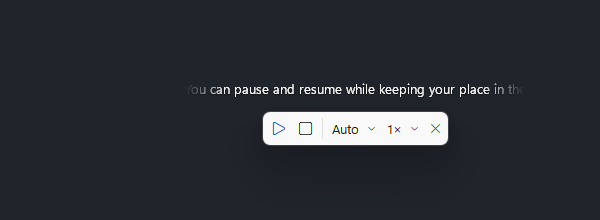
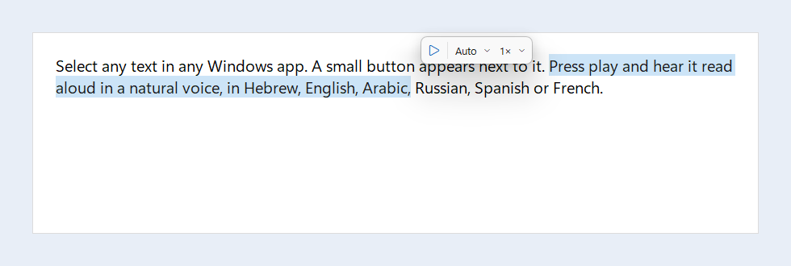
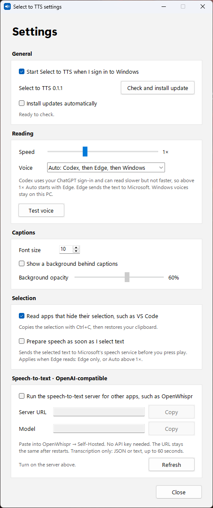

# Select to TTS

Select text in any Windows app and a small **▶ Auto ⌄ 1× ⌄** bar appears next to it. Press ▶ to hear the text read aloud. While it reads, ⏸ pauses, ▶ continues, and ■ stops.

A small sentence caption appears above the controls when that sentence starts playing. Its edges fade and long sentences pan across the line. Pause holds the sentence and its position, including between sentences. Stop, close, a replacement selection, and Test voice clear it.



Voices come from your existing **Codex / ChatGPT subscription** (Codex realtime voice, no OpenAI API key). If Codex is unavailable, the app falls back to Edge neural voices, then to the offline Windows voices.



## Install

Download **[SelectToTTS-Setup.exe](https://github.com/tzachbon/select-to-tts/releases/latest/download/SelectToTTS-Setup.exe)** and run it.
- It installs for your user only (`%LOCALAPPDATA%\Programs\Select to TTS`) and needs no admin rights.
- The installer isn't code-signed, so SmartScreen may warn you. Choose *More info*, then *Run anyway*.

For the ChatGPT voice, install the [Codex CLI](https://github.com/openai/codex) with npm and sign in once with `codex login`. Without it, the app uses the Edge and Windows voices.

Requirements: Windows 11, 64-bit.

## Use

1. Select text with the mouse (drag or double-click).
2. Press ▶ on the bar that appears. The language menu defaults to Auto.
3. Pick a reading speed from the speed menu on the bar. It is saved and shared with Settings.
4. ⏸ pauses and ▶ continues from the same spot. ■ stops. Selecting new text while paused replaces the paused read.

The app lives in the tray. Click the tray icon, or start the app again from the Start menu, to open **Settings**:



- **Start when I sign in to Windows**: adds or removes a Task Scheduler logon task named "Select to TTS". It starts right after sign-in, unlike Run-key apps, which Windows starts one at a time.
- **Speed**: 0.5× to 2×. Changes apply to the next read.
  - Edge and Windows voices support the full range.
  - Codex streams speech in real time, so it can only be slowed down. Above 1×, Auto starts with Edge, and "Codex only" reads at its natural pace.
- **Voice**: Auto (Codex, then Edge, then Windows), or one engine only. "Windows only" never sends text off the PC.
- **Captions**: font size (10 points by default, 8–24), optional background, and background opacity. Changes update the visible caption immediately without restarting speech.
- **Clipboard fallback**: for apps that hide their selection, such as VS Code, the app borrows Ctrl+C and then restores every clipboard format.
- **Prepare speech as soon as I select text**: off by default. When Edge reads (Edge only, or Auto above 1×), the app asks Microsoft's speech service for the first sentence's audio as soon as the bar appears. This sends that sentence before you press play, even if you never do. Password fields are never read. Later sentences are submitted only as the read advances.

Settings are saved in `%APPDATA%\select-to-tts\settings.json`. A small log is kept next to them in `select-to-tts.log`. It records the engine, timing (including the time to first audio), and errors, but never the text itself.

## Uninstall

Use *Settings > Apps > Select to TTS*. This removes the app, its sign-in task, and its caches in `%TEMP%`. Your settings and log in `%APPDATA%\select-to-tts` are kept.

## Run from source

```powershell
uv sync
uv run select-to-tts            # or start .venv\Scripts\select-to-tts.exe (no console window)
```

## Build the installer

Requires PowerShell 7.4+ (`pwsh`) and [Inno Setup 6](https://jrsoftware.org/isinfo.php) (`winget install JRSoftware.InnoSetup`).

```powershell
.\packaging\build.ps1           # PyInstaller app folder, then dist\SelectToTTS-Setup.exe
```

CI (`.github/workflows/build.yml`) runs the tests and builds the installer on every push. Pushing a `v*` tag publishes a release with the installer attached.

## How it works

| Piece | File |
| --- | --- |
| Mouse hook. A drag or double-click means text may be selected | `trigger.py` |
| Selected text via UI Automation, else a borrowed Ctrl+C with full clipboard restore. Password fields are never read | `selection.py`, `clipboard.py` |
| Floating button that never steals focus, with the language menu | `popup.py` |
| Sentence units and the native caption line | `sentences.py`, `captions.py` |
| Settings window and stored settings | `settings_ui.py`, `settings.py` |
| Codex realtime over `codex app-server`, using WebRTC v3 (the only transport that works without an API key) | `codex_rt.py` |
| Edge and Windows fallbacks, plus the ordered chain | `engines.py` |
| Speaker output and the slow-down time stretch (ffmpeg `atempo`) | `audio.py` |
| Tray icon and wiring | `__main__.py` |

Details, evidence, and the T1 feasibility results are in [PLAN.md](PLAN.md).

## Test

```powershell
uv run python -m unittest discover -s tests
uv run python -m select_to_tts.codex_rt "שלום עולם" he-IL     # hear the Codex engine directly
```

## Known limitations

- Codex's realtime API is marked experimental. A Codex update can break it, and the app then falls back to Edge.
- Speech is submitted one sentence or paragraph at a time, so gaps and changes in prosody can occur. Abbreviations can create shorter units. After the first successful sentence, the same engine reads the rest. Voice, language, and speed changes apply to the next complete selection.
- Roughly 1 in 12 Codex reads in testing ended early or stayed silent. Silence falls back automatically. An early stop does not.
- Each popup shown pre-starts a short Codex voice session. Sentence handoffs may need another session.
- Choosing a language from the menu moves keyboard focus away from the source app. The text is already captured.
- Only mouse selections trigger the button. Keyboard selections (Shift+arrows) don't.
- Pausing the Windows voice takes effect after about a second, because SAPI keeps playing audio it has already buffered. Codex and Edge pause at once.

## License

[MIT](LICENSE)
